# Responsive Collection Views

#### [Accompanying slides here](http://www.slideshare.net/bizz84/responsive-ios-collection-views)

Size classes are a powerful tool to complement Auto-Layout when making an iOS app responsive. 
While we can encode all layout information for various size classes in Interface Builder without a single line of code, there are still cases where we need to switch between different layouts programmatically.

One such case is when we want to update a collection view layout or use different cell types as the trait collection changes at runtime.

This demo project shows how to build a simplified version of the iOS Photos app, which chooses the most appropriate layout as the user enables split view mode and changes the window size.

## Outline

This simple app is composed of two screens:

* A master view controller showing a list of albums
* A detail view controller showing all the photos in a given album
* The master view controller should display all the cells: 
	* as a table-view style list on iPhone or iPad in compact width mode (split view enabled)
	* as a multiple column grid on iPad in regular width mode (split view disabled)
* The detail view controller should always display all the cells as a grid
	* with zero section inset and 1pt spacing between cells on iPhone 
	* with non-zero section inset and greater spacing between cells on iPad

## Implementation

The master view controller has a collection view with two types of cells:

* **Compact**: table-view style cell with the image on the left hand and disclosure button on the right
* **Regular**: grid style cell with labels below the main image

We will deliberately name the reuse IDs for these cells `AlbumCollectionViewCell-Compact` and `AlbumCollectionViewCell-Regular`.

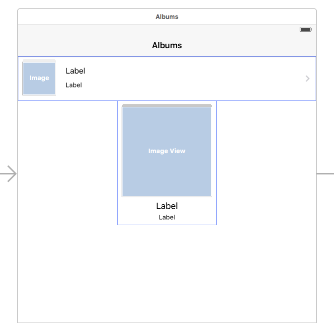

We can then create an enumeration that will describe the cell types we have defined like this:

```swift
enum AlbumsCollectionSizeClass: String {
    case Compact = "Compact"
    case Regular = "Regular"
    
    init(traitCollection: UITraitCollection) {
        
        self = traitCollection.horizontalSizeClass == .Regular &&
            traitCollection.verticalSizeClass == .Regular ? .Regular : .Compact
    }
}

extension AlbumsCollectionSizeClass {
    
    var cellReuseID: String {
        return "AlbumCollectionViewCell-\(self.rawValue)"
    }
}
```

This is so that our collection view `cellForItemAtIndexPath` delegate method can be defined as follows:

```
func collectionView(collectionView: UICollectionView, cellForItemAtIndexPath indexPath: NSIndexPath) -> UICollectionViewCell {
    
    let sizeClass = AlbumsCollectionSizeClass(traitCollection: self.traitCollection)
    let cell = collectionView.dequeueReusableCellWithReuseIdentifier(sizeClass.cellReuseID, forIndexPath: indexPath) as! AlbumCollectionViewCell
    
    // load image into cell
    updateCell(cell, indexPath: indexPath)
    
    return cell
}

```


## Master View Controller

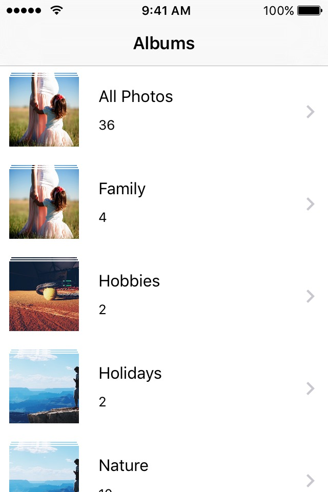
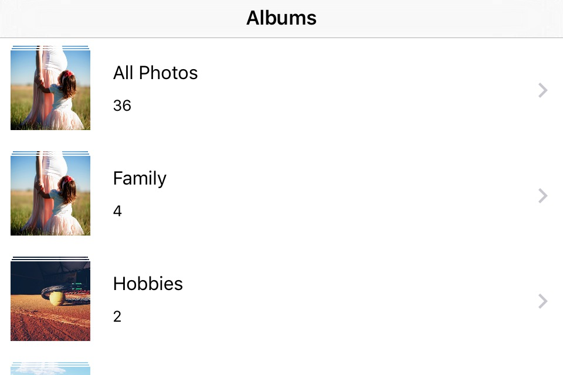

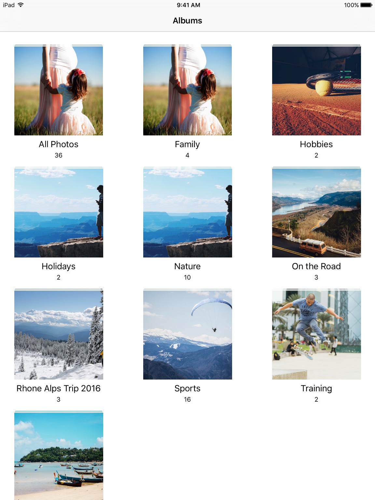
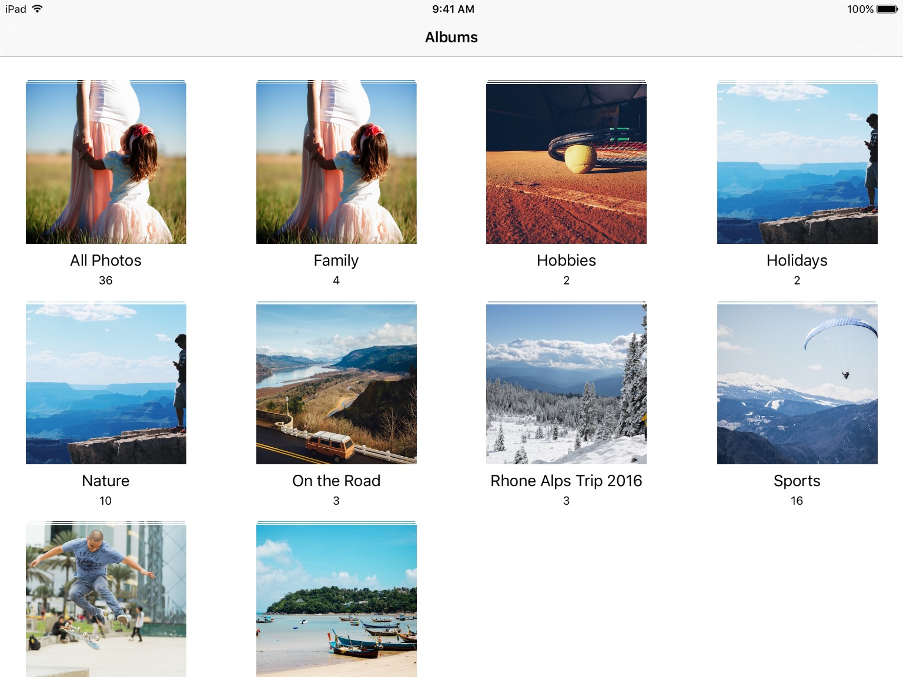


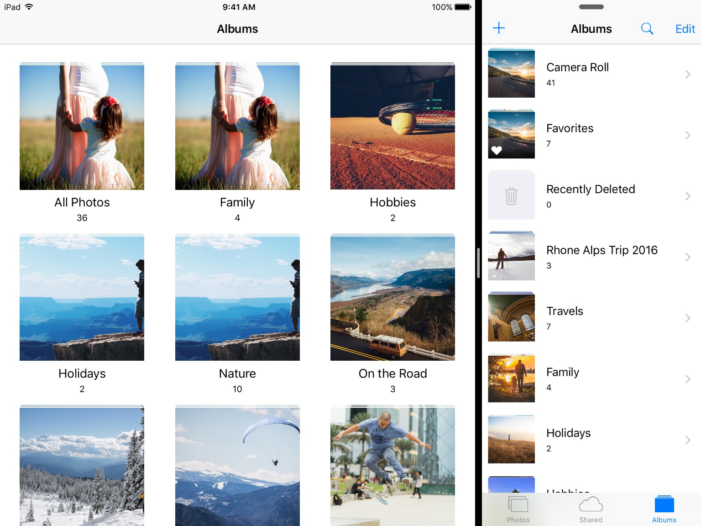
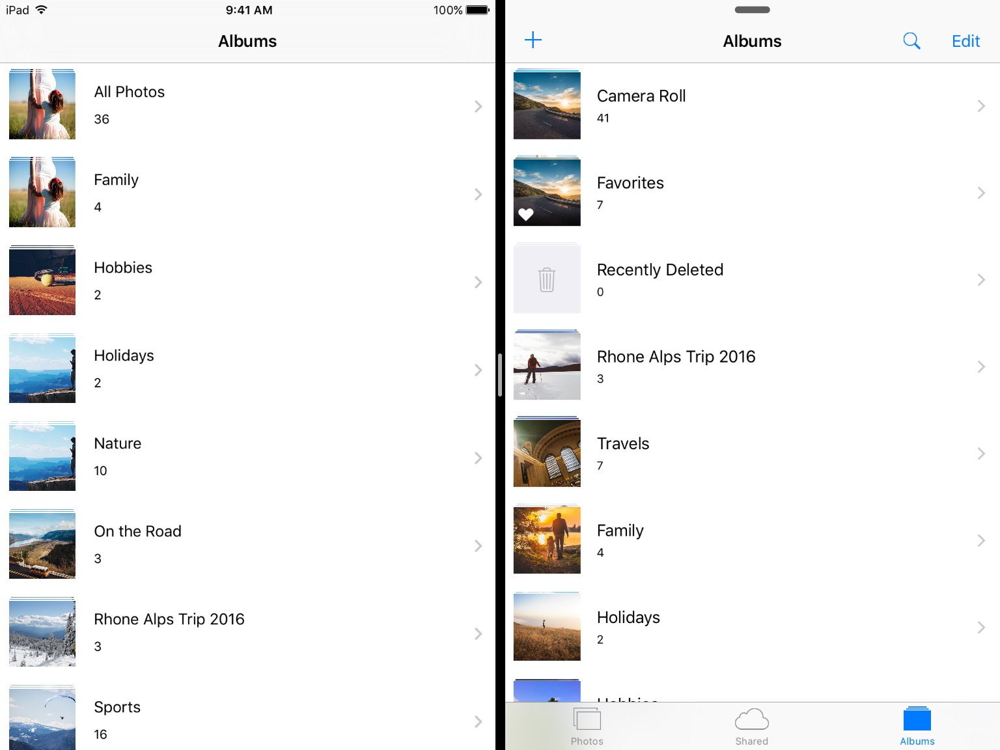


## Detail View Controller


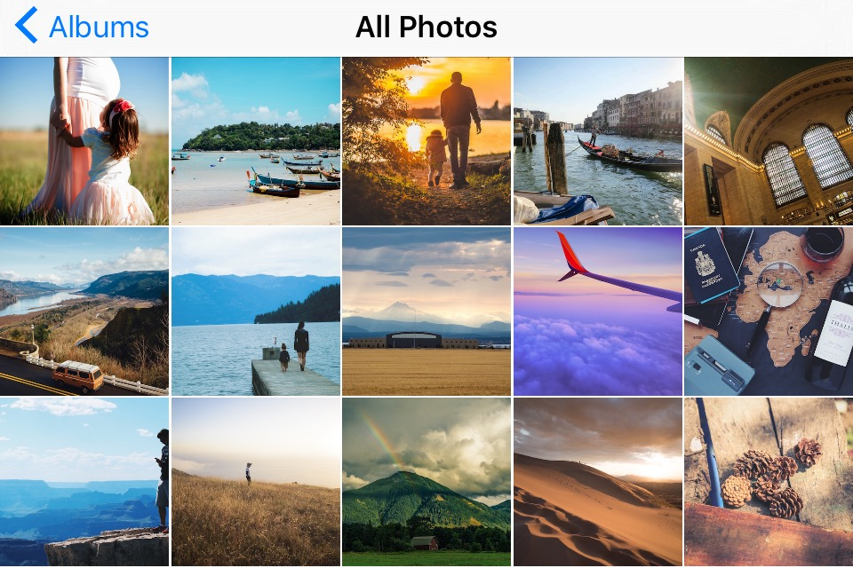

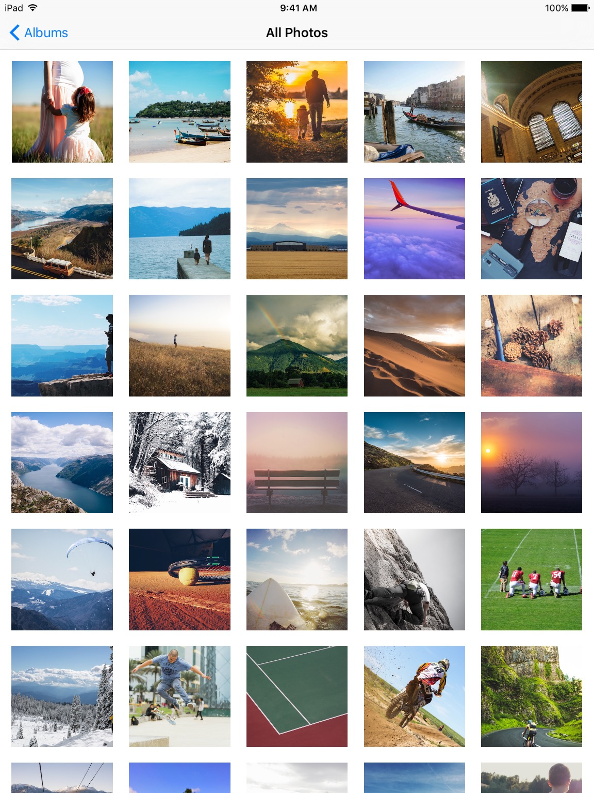
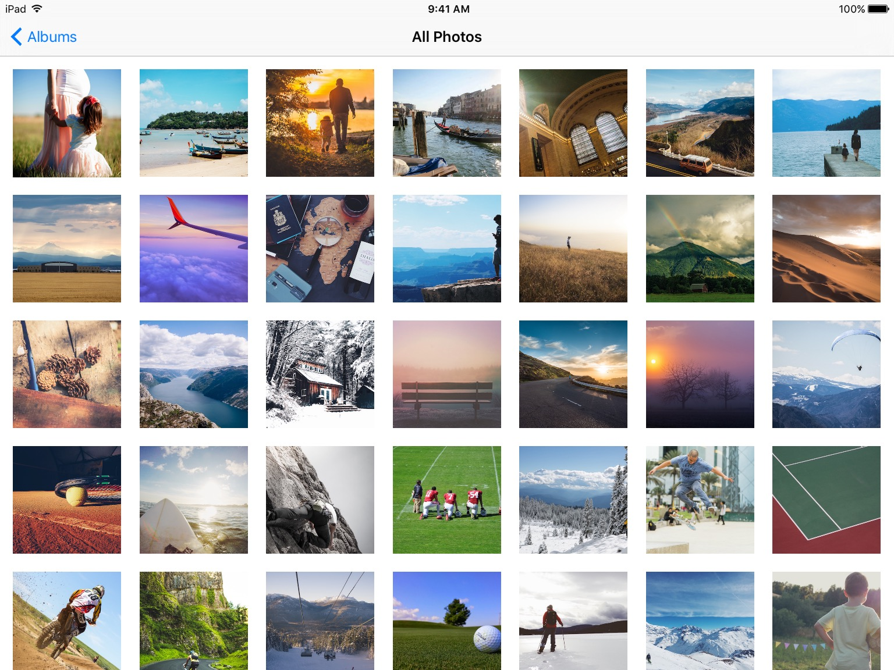

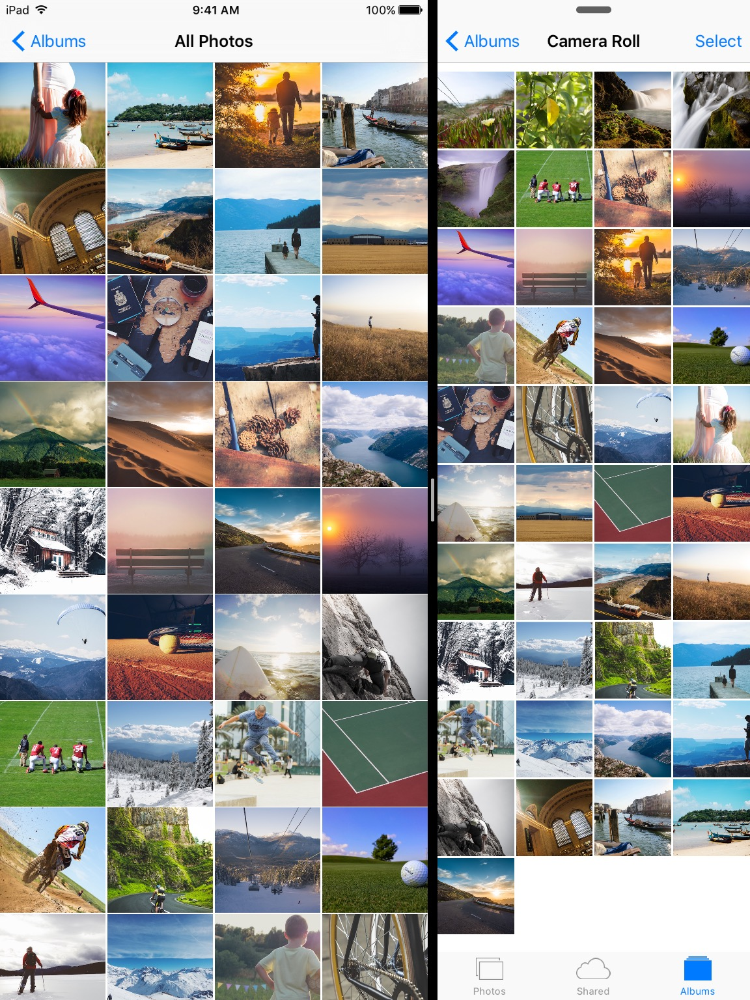
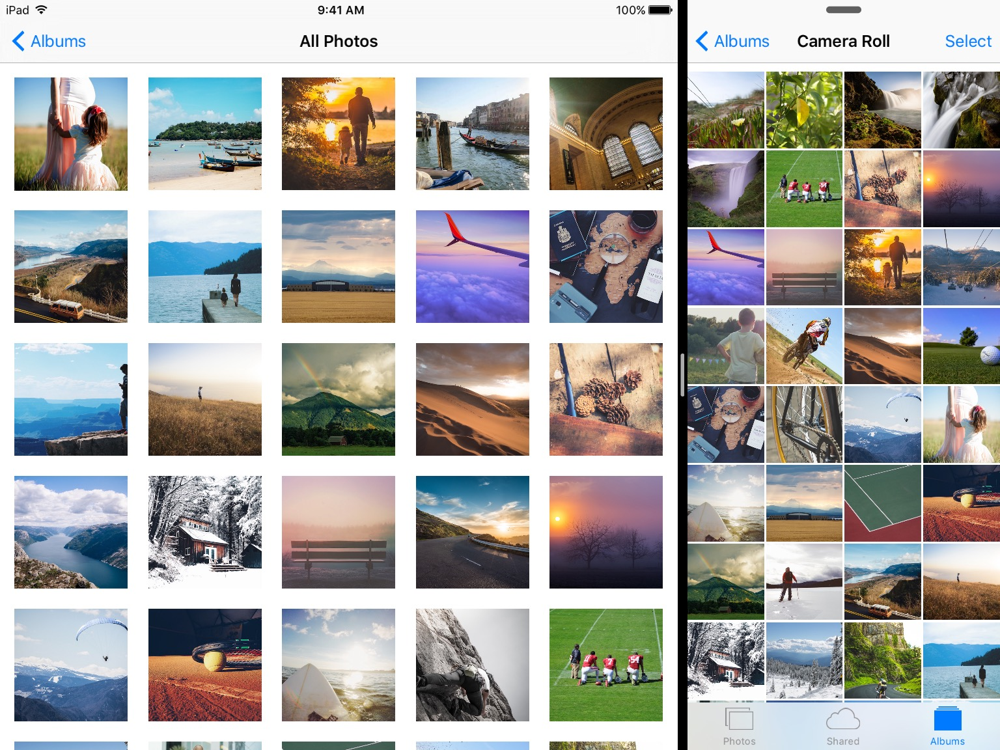
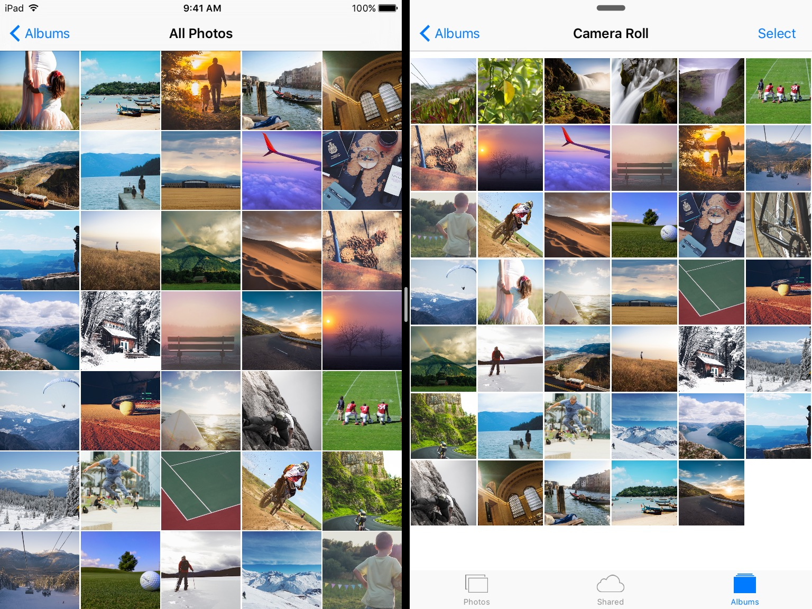


## License

Copyright (c) 2016 Andrea Bizzotto bizz84@gmail.com

Permission is hereby granted, free of charge, to any person obtaining a copy of this software and associated documentation files (the "Software"), to deal in the Software without restriction, including without limitation the rights to use, copy, modify, merge, publish, distribute, sublicense, and/or sell copies of the Software, and to permit persons to whom the Software is furnished to do so, subject to the following conditions:

The above copyright notice and this permission notice shall be included in all copies or substantial portions of the Software.

THE SOFTWARE IS PROVIDED "AS IS", WITHOUT WARRANTY OF ANY KIND, EXPRESS OR IMPLIED, INCLUDING BUT NOT LIMITED TO THE WARRANTIES OF MERCHANTABILITY, FITNESS FOR A PARTICULAR PURPOSE AND NONINFRINGEMENT. IN NO EVENT SHALL THE AUTHORS OR COPYRIGHT HOLDERS BE LIABLE FOR ANY CLAIM, DAMAGES OR OTHER LIABILITY, WHETHER IN AN ACTION OF CONTRACT, TORT OR OTHERWISE, ARISING FROM, OUT OF OR IN CONNECTION WITH THE SOFTWARE OR THE USE OR OTHER DEALINGS IN THE SOFTWARE.
